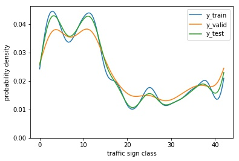
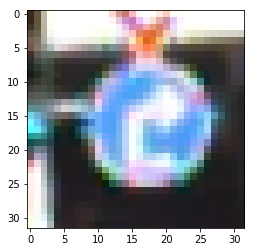
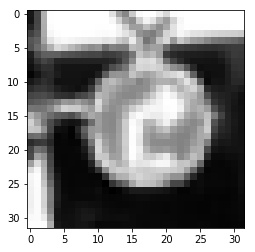
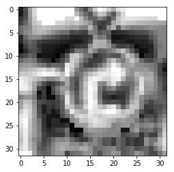

# **Traffic Sign Recognition**

## Writeup

**Build a Traffic Sign Recognition Project**

The goals / steps of this project are the following:
* Load the data set (see below for links to the project data set)
* Explore, summarize and visualize the data set
* Design, train and test a model architecture
* Use the model to make predictions on new images
* Analyze the softmax probabilities of the new images
* Summarize the results with a written report

[//]: # (Image References)

[image3]: ./examples/random_noise.jpg "Random Noise"

Here is a link to my [project code](https://github.com/KnollFrank/CarND-Traffic-Sign-Classifier-Project/blob/master/Traffic_Sign_Classifier.ipynb).

### Data Set Summary & Exploration

#### Summary

TODO:
- Provide a basic summary of the data set. In the code, the analysis should be done using python, numpy and/or pandas methods rather than hardcoding results manually.

I used the numpy library to calculate summary statistics of the traffic signs data set:

* The size of the training set is 34799
* The size of the validation set is 4410
* The size of the test set is 12630
* The shape of a traffic sign image is (32, 32, 3)
* The number of unique classes/labels in the data set is 43

#### Exploration

TODO:
- Include an exploratory visualization of the dataset.

Here is an exploratory visualization of the data set. It is a kernel density estimate of the traffic sign classes of the training data (y_train), the validation data (y_valid) and the test data (y_test):

The visualization above shows that the data sets have nearly the same distribution as the curves are quite similar.

### Design and Test a Model Architecture

#### Preprocessing

TODO:
- Describe how you preprocessed the image data. What techniques were chosen and why did you choose these techniques? Consider including images showing the output of each preprocessing technique. Pre-processing refers to techniques such as converting to grayscale, normalization, etc.

As a first step, I decided to convert the images to grayscale because ...

Here is an example of a traffic sign image before grayscaling:

and after grayscaling:

As a last step, I normalized the image data because ...

#### Final Model Achitecture

TODO:
- Describe what your final model architecture looks like including model type, layers, layer sizes, connectivity, etc.) Consider including a diagram and/or table describing the final model.

My final model consisted of the following layers:

|      Layer      |                 Description                 |
|:---------------:|:-------------------------------------------:|
|      Input      |           32x32x1 grayscale image           |
| Convolution 5x5 | 1x1 stride, valid padding, outputs 28x28x64 |
|      RELU       |                                             |
| Max pooling	2x2 |        2x2 stride,  outputs 14x14x16        |
| Convolution 5x5 | 1x1 stride, valid padding, outputs 10x10x32 |
|      RELU       |                                             |
| Max pooling	2x2 |         2x2 stride,  outputs 5x5x32         |
|     Flatten     |  Input = 5x5x32. Output = 5 * 5 * 32 = 800  |
| Fully connected |          Input = 800. Output = 120          |
|      RELU       |                                             |
|     Dropout     |                                             |
| Fully connected |          Input = 120. Output = 84           |
|      RELU       |                                             |
|     Dropout     |                                             |
| Fully connected |           Input = 84. Output = 10           |
|     Softmax     |                                             |
|     Output      |                     10                      |

#### Model Training

TODO:
- Describe how you trained your model. The discussion can include
  - (+) the type of optimizer,
  - (+) the batch size,
  - (+) number of epochs
  - and any hyperparameters such as
    - (+) learning rate,
    - (+) keep_prob
- cross_entropy

To train the model, I used an AdamOptimizer, a batch size of 128, number of epochs of 20, a learning rate of 0.001, `keep_prob` of 0.5 for each of the two dropout layers (`tf.nn.dropout`) of the model. While training the exact model is saved which best performs on the validation dataset (see `train()` function).

#### Finding a Solution Step by Step

TODO:
- Describe the approach taken for finding a solution and getting the validation set accuracy to be at least 0.93. Include in the discussion the results on the training, validation and test sets and where in the code these were calculated. Your approach may have been an iterative process, in which case, outline the steps you took to get to the final solution and why you chose those steps. Perhaps your solution involved an already well known implementation or architecture. In this case, discuss why you think the architecture is suitable for the current problem.
- vielleicht as bar chart oder radar chart darstellen (https://seaborn.pydata.org/generated/seaborn.barplot.html)

model_6_16_False_no_clahe:
- Training Accuracy = 0.993
- Validation Accuracy = 0.935
- Test Accuracy = 0.910

model_6_16_False:
- Training Accuracy = 0.998
- Validation Accuracy = 0.954
- Test Accuracy = 0.928

model_6_16_True:
- Training Accuracy = 0.996
- Validation Accuracy = 0.969
- Test Accuracy = 0.946

model_16_32_False:
- Training Accuracy = 0.999
- Validation Accuracy = 0.975
- Test Accuracy = 0.949

My final model results were:
model_16_32_True:
- Training Accuracy = 0.999
- Validation Accuracy = 0.974
- Test Accuracy = 0.961

If an iterative approach was chosen:
* What was the first architecture that was tried and why was it chosen?
* What were some problems with the initial architecture?
* How was the architecture adjusted and why was it adjusted? Typical adjustments could include choosing a different model architecture, adding or taking away layers (pooling, dropout, convolution, etc), using an activation function or changing the activation function. One common justification for adjusting an architecture would be due to overfitting or underfitting. A high accuracy on the training set but low accuracy on the validation set indicates over fitting; a low accuracy on both sets indicates under fitting.
* Which parameters were tuned? How were they adjusted and why?
* What are some of the important design choices and why were they chosen? For example, why might a convolution layer work well with this problem? How might a dropout layer help with creating a successful model?

If a well known architecture was chosen:
* What architecture was chosen?
* Why did you believe it would be relevant to the traffic sign application?
* How does the final model's accuracy on the training, validation and test set provide evidence that the model is working well?

### Test a Model on New Images

#### 1. Choose five German traffic signs found on the web and provide them in the report. For each image, discuss what quality or qualities might be difficult to classify.

Here are five German traffic signs that I found on the web:

The first image might be difficult to classify because ...

#### Predicting the Sign Type for Each Image

TODO:
- Discuss the model's predictions on these new traffic signs and compare the results to predicting on the test set. At a minimum, discuss what the predictions were, the accuracy on these new predictions, and compare the accuracy to the accuracy on the test set (OPTIONAL: Discuss the results in more detail as described in the "Stand Out Suggestions" part of the rubric).

Here are the results of the prediction:

Image|Prediction
:---:|:---:
Speed limit (30km/h)|Pedestrians
Stop|Stop
No vehicles|End of no passing
No entry|Turn left ahead
Children crossing|Road work

The model was able to correctly guess 4 of the 5 traffic signs, which gives an accuracy of 80%. This compares favorably to the accuracy on the test set of ...

#### Output Top 5 Softmax Probabilities For Each Image Found on the Web

TODO:
- Describe how certain the model is when predicting on each of the five new images by looking at the softmax probabilities for each prediction. Provide the top 5 softmax probabilities for each image along with the sign type of each probability. (OPTIONAL: as described in the "Stand Out Suggestions" part of the rubric, visualizations can also be provided such as bar charts)

The code for making predictions on my final model is in the function `get_top_5_predictions()` located in the Ipython notebook.

For the first image, the model is relatively sure that this is a stop sign (probability of 0.6), and the image does contain a stop sign. The top five soft max probabilities were

samples/classId_01.jpg (Speed limit (30km/h)):

Probability|Prediction
:---:|:---:
56%|Pedestrians
29%|Road narrows on the right
10%|Speed limit (30km/h)
4%|Double curve
1%|Right-of-way at the next intersection

samples/classId_14.jpg (Stop):

Probability|Prediction
:---:|:---:
100%|Stop
0%|Turn left ahead
0%|Keep right
0%|No entry
0%|Turn right ahead

samples/classId_15.jpg (No vehicles):

Probability|Prediction
:---:|:---:
99%|End of no passing
0%|No passing
0%|Yield
0%|Priority road
0%|End of no passing by vehicles over 3.5 metric tons

samples/classId_17.jpg (No entry):

Probability|Prediction
:---:|:---:
100%|Turn left ahead
0%|Keep right
0%|No entry
0%|Go straight or right
0%|Dangerous curve to the right

samples/classId_28.jpg (Children crossing):

Probability|Prediction
:---:|:---:
87%|Road work
12%|Turn right ahead
1%|Ahead only
0%|Stop
0%|Beware of ice/snow

For the second image ...
