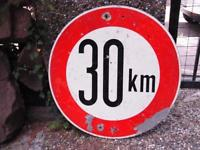
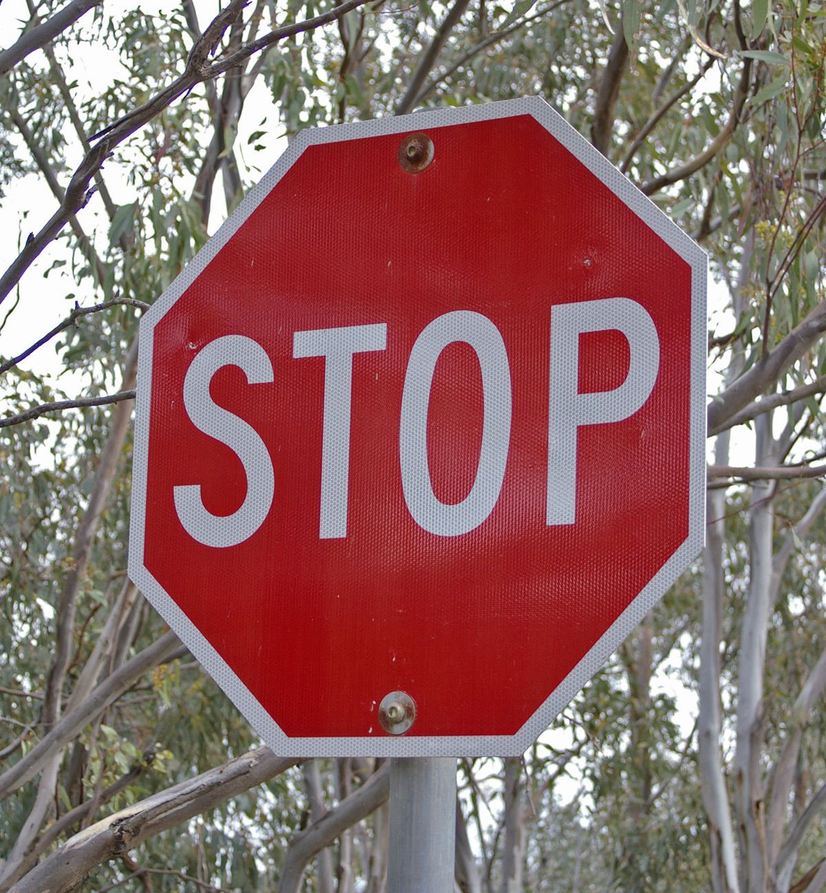
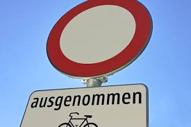
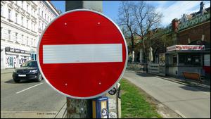
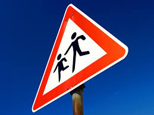

# **Traffic Sign Recognition**

**Build a Traffic Sign Recognition Project**

The goals / steps of this project are the following:
* Load the data set (see below for links to the project data set)
* Explore, summarize and visualize the data set
* Design, train and test a model architecture
* Use the model to make predictions on new images
* Analyze the softmax probabilities of the new images
* Summarize the results with a written report

Here is a link to my [project code](https://github.com/KnollFrank/CarND-Traffic-Sign-Classifier-Project/blob/master/Traffic_Sign_Classifier.ipynb).

## Data Set Summary & Exploration

### Summary

I used the numpy library to calculate summary statistics of the traffic signs data set:

* The size of the training set is 34799
* The size of the validation set is 4410
* The size of the test set is 12630
* The shape of a traffic sign image is (32, 32, 3)
* The number of unique classes/labels in the data set is 43

### Exploration

Here is an exploratory visualization of the data set. It is a kernel density estimate of the traffic sign classes of the training data (y_train), the validation data (y_valid) and the test data (y_test):

The visualization above shows that the data sets have nearly the same distribution as the curves are quite similar.

## Design and Test a Model Architecture

### Preprocessing

#### Grayscaling

As a first step, the images are converted to grayscale because color has no semantic meaning in traffic signs and it reduces the size of the data (one grey value per pixel instead of three values for red, green and blue).

Here is an example of a traffic sign image before grayscaling:

and after grayscaling:

#### Contrast Limited Adaptive Histogram Equalization

Then [CLAHE](https://en.wikipedia.org/wiki/Adaptive_histogram_equalization#Contrast_Limited_AHE) (Contrast Limited Adaptive Histogram Equalization) is applied in order to improve the contrast in the image:

#### Normalizing

As a last step, the image is normalized because it centers the mean at 0, which helps to avoid exploding or disappearing gradients when performing backpropagation while training the network.

### Final Model Achitecture

The final model is a convolutional neural network consisting of the following layers:

|      Layer      |                 Description                 |
|:---------------:|:-------------------------------------------:|
|      Input      |           32x32x1 grayscale image           |
| Convolution 5x5 | 1x1 stride, valid padding, outputs 28x28x16 |
|      RELU       |                                             |
| Max pooling	2x2 |        2x2 stride,  outputs 14x14x16        |
| Convolution 5x5 | 1x1 stride, valid padding, outputs 10x10x32 |
|      RELU       |                                             |
| Max pooling	2x2 |         2x2 stride,  outputs 5x5x32         |
|     Flatten     |  Input = 5x5x32. Output = 5 * 5 * 32 = 800  |
| Fully connected |          Input = 800, Output = 120          |
|      RELU       |                                             |
|     Dropout     |                                             |
| Fully connected |          Input = 120, Output = 84           |
|      RELU       |                                             |
|     Dropout     |                                             |
| Fully connected |           Input = 84, Output = 10           |
|     Softmax     |                                             |
|     Output      |                     10                      |

This model is adapted from the LeNet-5 solution from the lecture. Differing from LeNet-5 it has deeper convolutional layers (depths of 16 and 32 instead of 6 and 16) and it has two dropout layers in order to prevent overfitting.

### Model Training

The model was trained using an AdamOptimizer, a batch size of 128, number of epochs of 100, a learning rate of 0.001 and a `keep_prob` of 0.5 for each of the two `tf.nn.dropout` layers of the model. While training, the exact model is saved which best performs on the validation dataset (see `train()` function).

### Finding a Solution Step by Step

The initial model was the LeNet-5 solution from the lecture applied to RGB traffic sign images without any preprocessing. It achieved a training accuracy of 0.993 and a validation accuracy of 0.905 which is below the target of 0.93. These accuracies are calculated in the function `evaluate_accuracy(model, X, y)` of the notebook.

Then the RGB images were converted to grayscale (in order to reduce the size of the images) and normalized (in order to prevent exploding or disappearing gradients when performing backpropagation while training the network) as preprocessing steps. This resulted in a training  accuracy of 0.993 and improved the validation accuracy a little bit from 0.93 to 0.935.

Then Contrast Limited Adaptive Histogram Equalization was applied to the grayscaled images as a further preprocessing step in order to improve the contrast in the images. This resulted in a training accuracy of 0.998 and improved the validation accuracy from 0.935 to 0.954.

Then two dropout layers were added to the model as can be seen in the table of the section "Final Model Achitecture" in order to prevent overfitting. This resulted in a training accuracy of 0.996 and improved the validation accuracy from 0.954 to 0.969.

Then the two convolutional layers of the model were enhanced to have depths of 16 and 32 instead of the former depths of 6 and 16 of the initial LeNet-5 model. The hope was that more convolutional filters can recognize more features (like arrows, rounded corners, ...) of traffic signs in images in order to classify them correctly. This resulted in a training accuracy of 0.999 and improved the validation accuracy from 0.969 to 0.978.

Finally, the actual model was trained for 100 epochs instead of just 20. This resulted in a training accuracy of 0.998 and improved the validation accuracy from 0.978 to 0.984 which is above the target of 0.93. This model was taken as the final model yielding a test set accuracy of 0.959.

## Test a Model on New Images

Here are five German traffic signs that I found on the web:

Class                | Image                                           | Description
---------------------|-------------------------------------------------|----------------------------------------------------------------------------------------------------------------------------------
Speed limit (30km/h) |  | This image might be difficult to classify because it has "km" next to "30" in contrast to the training images which have no "km".
Stop                 |                  | This image has a background showing branches of trees which could confuse the classifier.
No vehicles          |           | This image might be difficult to classify because it is perspectively distorted.
No entry             |              | This image might be difficult to classify because the traffic sign is relatively small compared to the size of the background.
Children crossing    |     | This image might be difficult to classify because it is perspectively distorted.

### Predicting the Sign Type for Each Image

TODO:
- Discuss the model's predictions on these new traffic signs and compare the results to predicting on the test set. At a minimum, discuss what the predictions were, the accuracy on these new predictions, and compare the accuracy to the accuracy on the test set (OPTIONAL: Discuss the results in more detail as described in the "Stand Out Suggestions" part of the rubric).

Here are the results of the prediction:

Image|Prediction
:---:|:---:
Speed limit (30km/h)|Speed limit (30km/h)
Stop|Stop
No vehicles|No passing
No entry|Turn left ahead
Children crossing|Road work

The model was able to correctly guess 4 of the 5 traffic signs, which gives an accuracy of 80%. This compares favorably to the accuracy on the test set of ...

### Top 5 Softmax Probabilities For Each Image Found on the Web

TODO:
- Describe how certain the model is when predicting on each of the five new images by looking at the softmax probabilities for each prediction. Provide the top 5 softmax probabilities for each image along with the sign type of each probability. (OPTIONAL: as described in the "Stand Out Suggestions" part of the rubric, visualizations can also be provided such as bar charts)

The code for making predictions on my final model is in the function `get_top_5_predictions()` located in the Ipython notebook.

For the first image, the model is relatively sure that this is a stop sign (probability of 0.6), and the image does contain a stop sign. The top five soft max probabilities were

samples/classId_01.jpg (Speed limit (30km/h)):

Probability|Prediction
:---:|:---:
98%|Speed limit (30km/h)
2%|Speed limit (50km/h)
0%|End of speed limit (80km/h)
0%|Speed limit (20km/h)
0%|Keep left

samples/classId_14.jpg (Stop):

Probability|Prediction
:---:|:---:
89%|Stop
8%|No vehicles
2%|Turn left ahead
1%|No entry
0%|Yield

samples/classId_15.jpg (No vehicles):

Probability|Prediction
:---:|:---:
77%|No passing
14%|End of no passing
8%|Priority road
1%|Keep right
0%|Yield

samples/classId_17.jpg (No entry):

Probability|Prediction
:---:|:---:
88%|Turn left ahead
12%|Keep right
0%|No entry
0%|End of no passing
0%|Speed limit (50km/h)

samples/classId_28.jpg (Children crossing):

Probability|Prediction
:---:|:---:
76%|Road work
19%|Right-of-way at the next intersection
1%|Pedestrians
1%|Children crossing
1%|Go straight or right

For the second image ...
